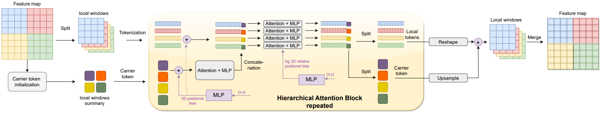

# FasterViT: Fast Vision Transformers with Hierarchical Attention

Official PyTorch implementation of **FasterViT: Fast Vision Transformers with Hierarchical Attention**.

FasterViT: Fast Vision Transformers

[Ali Hatamizadeh](https://research.nvidia.com/person/ali-hatamizadeh),
[Greg Heinrich](https://developer.nvidia.com/blog/author/gheinrich/),
[Hongxu (Danny) Yin](https://scholar.princeton.edu/hongxu),
[Andrew Tao](https://developer.nvidia.com/blog/author/atao/),
[Jose M. Alvarez](https://alvarezlopezjosem.github.io/),
[Jan Kautz](https://jankautz.com/), 
[Pavlo Molchanov](https://www.pmolchanov.com/).

NVIDIA

For business inquiries, please visit our website and submit the form: [NVIDIA Research Licensing](https://www.nvidia.com/en-us/research/inquiries/)


--- 

FasterViT achieves a SOTA Pareto-front in
terms of accuracy vs. image throughput.

<p align="center">

</p>


We introduce a new self-attention mechanism, denoted as Hierarchical
Attention (HAT), that captures both short and long-range information by learning
cross-window carrier tokens.



## 💥 News 💥

- **[06.09.2023]** 🔥🔥 We have released source code and ImageNet-1K FasterViT-models !

## Results

### ImageNet-1K
**FasterViT ImageNet-1K Pretrained Models**

<table>
  <tr>
    <th>Name</th>
    <th>Acc@1(%)</th>
    <th>Acc@5(%)</th>
    <th>Throughput(Img/Sec)</th>
    <th>Resolution</th>
    <th>#Params(M)</th>
    <th>FLOPs(G)</th>
    <th>Download</th>
  </tr>

<tr>
    <td>FasterViT-0</td>
    <td>82.1</td>
    <td>95.9</td>
    <td>5802</td>
    <td>224x224</td>
    <td>31.4</td>
    <td>3.3</td>
    <td><a href="https://drive.google.com/uc?export=download&id=1twI2LFJs391Yrj8MR4Ui9PfrvWqjE1iB">model</a></td>
</tr>

<tr>
    <td>FasterViT-1</td>
    <td>83.2</td>
    <td>96.5</td>
    <td>4188</td>
    <td>224x224</td>
    <td>53.4</td>
    <td>5.3</td>
    <td><a href="https://drive.google.com/uc?export=download&id=1r7W10n5-bFtM3sz4bmaLrowN2gYPkLGT">model</a></td>
</tr>

<tr>
    <td>FasterViT-2</td>
    <td>84.2</td>
    <td>96.8</td>
    <td>3161</td>
    <td>224x224</td>
    <td>75.9</td>
    <td>8.7</td>
    <td><a href="https://drive.google.com/uc?export=download&id=1n_a6s0pgi0jVZOGmDei2vXHU5E6RH5wU">model</a></td>
</tr>

<tr>
    <td>FasterViT-3</td>
    <td>84.9</td>
    <td>97.2</td>
    <td>1780</td>
    <td>224x224</td>
    <td>159.5</td>
    <td>18.2</td>
    <td><a href="https://drive.google.com/uc?export=download&id=1tvWElZ91Sia2SsXYXFMNYQwfipCxtI7X">model</a></td>
</tr>

<tr>
    <td>FasterViT-4</td>
    <td>85.4</td>
    <td>97.3</td>
    <td>849</td>
    <td>224x224</td>
    <td>424.6</td>
    <td>36.6</td>
    <td><a href="https://drive.google.com/uc?export=download&id=1gYhXA32Q-_9C5DXel17avV_ZLoaHwdgz">model</a></td>
</tr>

<tr>
    <td>FasterViT-5</td>
    <td>85.6</td>
    <td>97.4</td>
    <td>449</td>
    <td>224x224</td>
    <td>975.5</td>
    <td>113.0</td>
    <td><a href="https://drive.google.com/uc?export=download&id=1mqpai7XiHLr_n1tjxjzT8q369xTCq_z-">model</a></td>
</tr>

<tr>
    <td>FasterViT-6</td>
    <td>85.8</td>
    <td>97.4</td>
    <td>352</td>
    <td>224x224</td>
    <td>1360.0</td>
    <td>142.0</td>
    <td><a href="https://drive.google.com/uc?export=download&id=12jtavR2QxmMzcKwPzWe7kw-oy34IYi59">model</a></td>
</tr>

</table>


### ImageNet-A - ImageNet-R - ImageNet-V2

All models use `crop_pct=0.875`. Results are obtained by running inference on ImageNet-1K pretrained models without finetuning.
<table>
  <tr>
    <th>Name</th>
    <th>A-Acc@1(%)</th>
    <th>A-Acc@5(%)</th>
    <th>R-Acc@1(%)</th>
    <th>R-Acc@5(%)</th>
    <th>V2-Acc@1(%)</th>
    <th>V2-Acc@5(%)</th>
  </tr>

<tr>
    <td>FasterViT-0</td>
    <td>23.9</td>
    <td>57.6</td>
    <td>45.9</td>
    <td>60.4</td>
    <td>70.9</td>
    <td>90.0</td>
</tr>

<tr>
    <td>FasterViT-1</td>
    <td>31.2</td>
    <td>63.3</td>
    <td>47.5</td>
    <td>61.9</td>
    <td>72.6</td>
    <td>91.0</td>
</tr>

<tr>
    <td>FasterViT-2</td>
    <td>38.2</td>
    <td>68.9</td>
    <td>49.6</td>
    <td>63.4</td>
    <td>73.7</td>
    <td>91.6</td>
</tr>

<tr>
    <td>FasterViT-3</td>
    <td>44.2</td>
    <td>73.0</td>
    <td>51.9</td>
    <td>65.6</td>
    <td>75.0</td>
    <td>92.2</td>
</tr>

<tr>
    <td>FasterViT-4</td>
    <td>49.0</td>
    <td>75.4</td>
    <td>56.0</td>
    <td>69.6</td>
    <td>75.7</td>
    <td>92.7</td>
</tr>

<tr>
    <td>FasterViT-5</td>
    <td>52.7</td>
    <td>77.6</td>
    <td>56.9</td>
    <td>70.0</td>
    <td>76.0</td>
    <td>93.0</td>
</tr>

<tr>
    <td>FasterViT-6</td>
    <td>53.7</td>
    <td>78.4</td>
    <td>57.1</td>
    <td>70.1</td>
    <td>76.1</td>
    <td>93.0</td>
</tr>

</table>


## Training

Please see [TRAINING.md](TRAINING.md) for detailed training instructions of all models. 

## Evaluation

To evaluate a pre-trained checkpoint using ImageNet-1K validation set:

```bash
python validate.py --model <model-name> --checkpoint <checkpoint-path> --data_dir <imagenet-path> --batch-size <batch-size-per-gpu>
```

## Installation

The dependencies can be installed by running:

```bash
pip install -r requirements.txt
```


## Data Preparation

Please download the ImageNet dataset from its official website. The training and validation images need to have
sub-folders for each class with the following structure:

```bash
  imagenet
  ├── train
  │   ├── class1
  │   │   ├── img1.jpeg
  │   │   ├── img2.jpeg
  │   │   └── ...
  │   ├── class2
  │   │   ├── img3.jpeg
  │   │   └── ...
  │   └── ...
  └── val
      ├── class1
      │   ├── img4.jpeg
      │   ├── img5.jpeg
      │   └── ...
      ├── class2
      │   ├── img6.jpeg
      │   └── ...
      └── ...
 
  ```


## Licenses

Copyright © 2023, NVIDIA Corporation. All rights reserved.

This work is made available under the Nvidia Source Code License-NC. Click [here](LICENSE) to view a copy of this license.

For license information regarding the timm repository, please refer to its [repository](https://github.com/rwightman/pytorch-image-models).

For license information regarding the ImageNet dataset, please see the [ImageNet official website](https://www.image-net.org/). 
